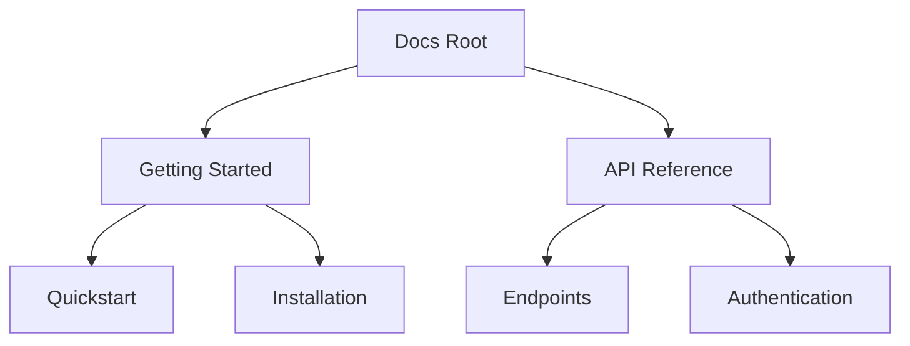

## Overview

Vandar empowers you to create professional documentation sites with ease. You organize content hierarchically, collaborate seamlessly, search efficiently, customize appearances, and share or export your work. These core features form the foundation for scalable documentation projects.

<Callout kind="info">
Use these features to structure your docs efficiently from the start.
</Callout>

## Key Features

<Columns cols={3}>
  <Card title="Document Organization" icon="folder-tree" href="#organization">
    Build nested hierarchies and manage pages intuitively.
  </Card>
  <Card title="Version Control" icon="git-branch" href="#version-control">
    Track changes and collaborate with your team.
  </Card>
  <Card title="Search & Indexing" icon="search" href="#search">
    Enable fast, accurate content discovery.
  </Card>
  <Card title="Customization" icon="palette" href="#customization">
    Tailor templates and themes to your brand.
  </Card>
  <Card title="Export & Sharing" icon="share-2" href="#export" horizontal>
    Publish and distribute your docs anywhere.
  </Card>
</Columns>

## Document Organization and Hierarchies

Create structured documentation with nested pages and sidebars. You define hierarchies using folder structures or YAML frontmatter, enabling intuitive navigation.



<Expandable title="Advanced Hierarchy Tips" default-open="false">

Use sidebar configuration to control visibility:

````yaml
sidebar:
  - label: Guides
    items:
      - label: Quickstart
        href: /quickstart
      - label: Authentication
        href: /authentication
````

</Expandable>

## Version Control and Collaboration Tools

Integrate with Git for version control. You branch, merge, and review changes directly in Vandar. Team members collaborate via pull requests and inline comments.

<Tabs>
  <Tab title="GitHub" icon="github">
    Connect your repo for automatic deployments.
    
    <Steps>
      <Step title="Connect Repo">
        Link your GitHub account in settings.
      </Step>
      <Step title="Branch Protection">
        Enable reviews for main branch.
      </Step>
    </Steps>
  </Tab>
  <Tab title="GitLab" icon="git-branch">
    Similar workflow for GitLab repositories.
    
    ```bash
    git push origin feature/docs-improvements
    ```
  </Tab>
</Tabs>

<Callout kind="tip">
Always use descriptive commit messages like `docs: add authentication guide`.
</Callout>

## Search and Indexing Functionalities

Vandar's built-in search indexes your content for instant results. You enable full-text search across pages, code blocks, and headings.

| Feature | Description | Enabled By Default |
|---------|-------------|--------------------|
| Full-Text Search | Searches titles, body, and code | Yes |
| Code Search | Highlights matches in snippets | No |
| Filters | By section or tags | Yes |

Configure advanced indexing:

<CodeGroup tabs="JavaScript,Python">
  ```javascript
  // config.js
  module.exports = {
    search: {
      provider: 'lunr',
      fields: ['title', 'body', 'headings']
    }
  };
  ```
  ```python
  # config.py
  SEARCH_CONFIG = {
      'provider': 'lunr',
      'fields': ['title', 'body', 'headings']
  }
  ```
</CodeGroup>

## Template and Theme Customization

Customize your site's look with themes and components. You override styles, add custom MDX components, and inject brand elements.

<Steps>
  <Step title="Install Theme">
    Add to your config:
    
````json
{
  "theme": "custom",
  "colors": {
    "primary": "#3B82F6"
  }
}
````
  </Step>
  <Step title="Custom Components">
    Create `components/CustomCallout.jsx` and register it.
  </Step>
  <Step title="Apply Changes">
    Restart dev server: `npm run dev`.
  </Step>
</Steps>

## Export and Sharing Options

Export your docs as static sites, PDFs, or share via public links. You generate hosted versions or download bundles for offline use.

```bash
# Export to static site
npm run build:export

# Share via link
npm run deploy:vercel
```

<Columns cols={2}>
  <Card title="Static Export" icon="download">
    Generate HTML for hosting anywhere.
  </Card>
  <Card title="PDF Generation" icon="file-text">
    Convert sections to printable PDFs.
  </Card>
</Columns>

## Next Steps

Explore [Quickstart](/quickstart) to set up your first project, or dive into [Authentication](/authentication) for secure access. Customize these features to fit your workflow.