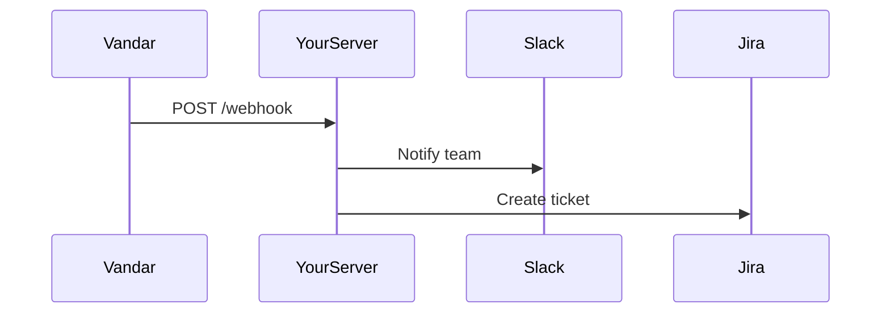

## Overview

Vandar supports seamless integrations with popular tools to streamline your documentation workflow. Sync changes from Git repositories, set up webhooks for real-time notifications, access the API for custom automations, embed external content, and connect with services like Slack and Jira. These features help you automate updates, notify teams, and extend functionality without custom development.

<Columns cols={3}>
  <Card title="Git Sync" icon="git-branch" href="#git-repository-syncing">
    Automatically pull changes from your repository into Vandar docs.
  </Card>
  <Card title="API Access" icon="api" href="#api-access">
    Build custom integrations using RESTful API endpoints.
  </Card>
  <Card title="Webhooks" icon="zap" href="#webhook-setup">
    Receive instant notifications for doc updates and events.
  </Card>
</Columns>

## Git Repository Syncing

Keep your Vandar documentation in sync with your Git repository. Enable automatic pulls from GitHub, GitLab, or Bitbucket whenever you push changes.

<Steps>
  <Step title="Connect Repository" icon="git-branch">
    Navigate to Settings > Integrations > Git Sync.
    
    Enter your repository URL (e.g., `https://github.com/your-org/your-repo.git`) and select the branch.
  </Step>
  <Step title="Authenticate" icon="key">
    Grant Vandar read access via OAuth or personal access token.
  </Step>
  <Step title="Configure Sync" icon="settings">
    Choose sync frequency (e.g., on push, hourly) and path mappings.
    
````bash
# Example GitHub token setup
export GITHUB_TOKEN=your-token-here
````
  </Step>
  <Step title="Test Sync" icon="play">
    Trigger a manual sync and verify changes appear in Vandar.
  </Step>
</Steps>

<Callout kind="tip">
Test with a sample commit first to ensure mappings work correctly.
</Callout>

## API Access for Custom Integrations

Vandar provides a REST API at `https://api.example.com/v1` for programmatic access. Use it to create, update, or query documentation.

<CodeGroup tabs="JavaScript,Python">
````javascript
const response = await fetch('https://api.example.com/v1/docs', {
  method: 'POST',
  headers: {
    'Authorization': `Bearer ${YOUR_API_KEY}`,
    'Content-Type': 'application/json'
  },
  body: JSON.stringify({
    title: 'New Doc',
    content: '# Hello World'
  })
});
````

````python
import requests

response = requests.post(
  'https://api.example.com/v1/docs',
  headers={
    'Authorization': f'Bearer {YOUR_API_KEY}',
    'Content-Type': 'application/json'
  },
  json={
    'title': 'New Doc',
    'content': '# Hello World'
  }
)
````
</CodeGroup>

<ParamField path="docs" param-type="string" required="true">
Document ID or slug.
</ParamField>

<ParamField header="Authorization" param-type="string" required="true">
Bearer token obtained from Settings > API Keys.
</ParamField>

## Webhook Setup for Notifications

Configure webhooks to send events like doc updates or publish actions to external services.



<Tabs>
  <Tab title="Slack" icon="message-circle">
    Set your Slack webhook URL as the endpoint.
    
````javascript
// Payload example
{
  "event": "doc.updated",
  "doc_id": "abc123",
  "url": "https://docs.example.com/doc/abc123"
}
````
  </Tab>
  <Tab title="Jira" icon="square">
    Use Jira's webhook or API to create issues from Vandar events.
    
    Map `event` to issue type and `content` to description.
  </Tab>
</Tabs>

<Steps>
  <Step title="Create Webhook" icon="plus">
    Go to Settings > Webhooks > New Webhook.
    
    Enter `https://your-webhook-url.com/vandar` as the URL.
  </Step>
  <Step title="Select Events" icon="zap">
    Choose triggers like `doc.published` or `page.updated`.
  </Step>
  <Step title="Verify" icon="check-circle">
    Test with a sample event and check your endpoint logs.
  </Step>
</Steps>

## Embedding External Content

Embed live content from third-party tools directly into your Vandar pages using iframes or oEmbed.

<Expandable title="Advanced Embedding Options" default-open="false">
Use `<Iframe>` component for secure embeds:
````mdx
<Iframe
  src="https://your-tool.com/widget/123"
  title="External Widget"
  width="100%"
  height="400"
/>
````

Ensure CORS settings on the external site allow embedding.
</Expandable>

## Popular Tool Connections

Explore ready-made connections:

| Tool   | Use Case                  | Setup Time |
|--------|---------------------------|------------|
| Slack  | Team notifications       | 2 minutes |
| Jira   | Issue tracking sync      | 5 minutes |
| GitHub | Auto-sync repositories   | 3 minutes |

<Callout kind="success" title="Get Started">
Visit [Settings > Integrations](https://dashboard.example.com/settings/integrations) to enable these now.
</Callout>

<Columns cols={2}>
  <Card title="More Integrations" icon="plug" href="https://docs.example.com/integrations/advanced" target="_blank">
    Discover Zapier, Microsoft Teams, and more.
  </Card>
  <Card title="API Reference" icon="book-open" href="/authentication#api-keys">
    Full API docs with authentication details.
  </Card>
</Columns>